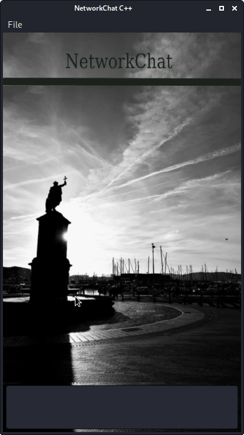
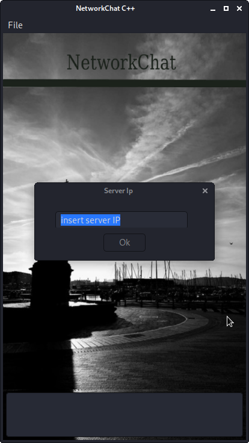

# Network chat

This is a starter repo for the Capstone project in the [Udacity C++ Nanodegree Program](https://www.udacity.com/course/c-plus-plus-nanodegree--nd213).

This project is about a chat using wxWidget and sockets. The main obejctive is to provide to the user an GUI interface for chating with someoneelse in
the same network. Future developments will extend it to be used with clients in different networks.

## Dependencies for Running Locally
* cmake >= 3.7
  * All OSes: [click here for installation instructions](https://cmake.org/install/)
* make >= 4.1 (Linux, Mac), 3.81 (Windows)
  * Linux: make is installed by default on most Linux distros
  * Mac: [install Xcode command line tools to get make](https://developer.apple.com/xcode/features/)
  * Windows: [Click here for installation instructions](http://gnuwin32.sourceforge.net/packages/make.htm)
* gcc/g++ >= 5.4
  * Linux: gcc / g++ is installed by default on most Linux distros
  * Mac: same deal as make - [install Xcode command line tools](https://developer.apple.com/xcode/features/)
  * Windows: recommend using [MinGW](http://www.mingw.org/)
* wxwidget:
  * Follow the instructions here https://wiki.wxwidgets.org/Install.

## Basic Build Instructions

1. Clone this repo.
2. Make a build directory in the top level directory: `mkdir build && cd build`
3. Compile: `cmake .. && make`
4. Run it: `./NetworkChat`.

## Instruction fortesting the App in your local machine.

1. Open one instance of NetworkChat.
2. In the menu file, choose listen. The instance will be waiting for a client.

3. Open another instance of NetworkChat.
4. Choose connect in the file menu. A box will appear. There, you can write the ip of your local machine (127.0.0.1).

5. Test it writing in both chats and cheacking that the message appear in the other.